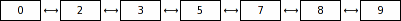
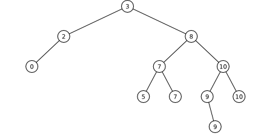
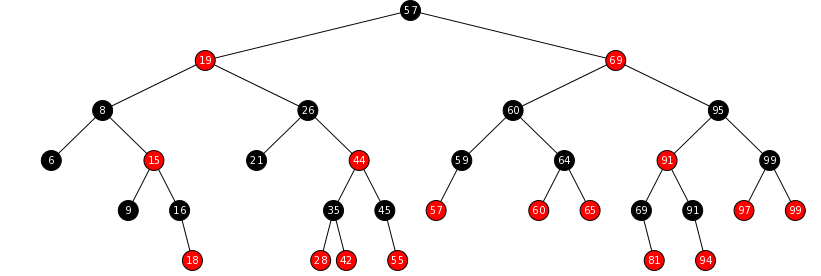
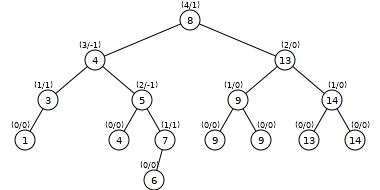

## Data Structures grapaher generator
# Description
This software implementation can graph in SVG format the next data structures:
 * List: NameOfClass `Lista`
 * Queue: NameOfClass `Cola`
 * Stack: NameOfClass `Pila`
 * Binary Tree:
     1.- Complete Binary Tree (NameOfClass `ArbolBinarioCompleto`).
     2.- Ordered Binary Tree (NameOfClass `ArbolBinarioOrdenado`).
     3.- Red-black Binary Tree (NameOfClass `ArbolRojinegro`).
     4.- AVL Binary Tree (NameOfClass `ArbolAVL`).
 * Graph: NameOfClass `Grafica`
# Use
Ensure have java 11 + version and maven, you can try: 
 * `mvn install` then `java -jar target/Proyecto2.jar NameOfClass N > file.svg` or input form `cat file.txt | java -jar target/Proyecto2.jar > file.svg`
   where "N" are a set`s integers like " 1 23 4 12 10 8 ..."
# Examples

